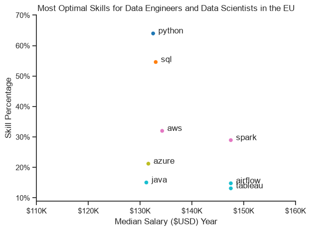
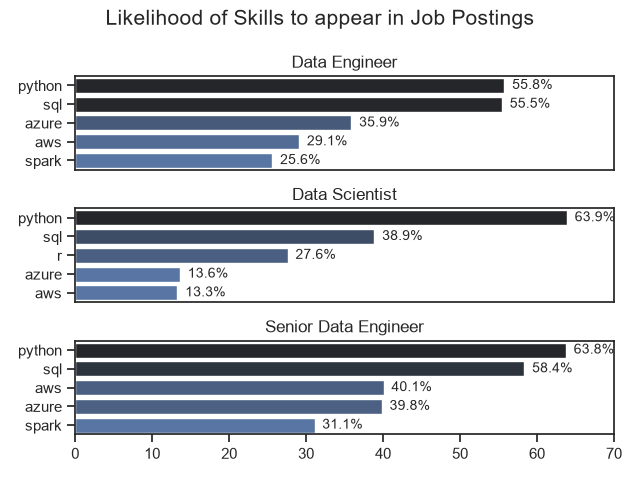
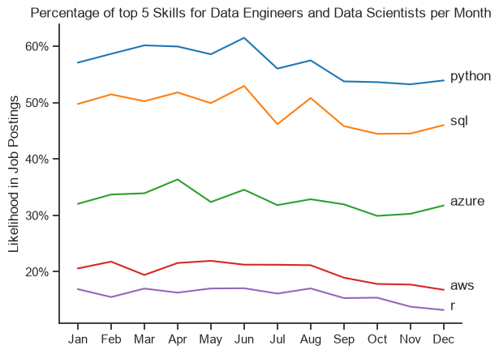
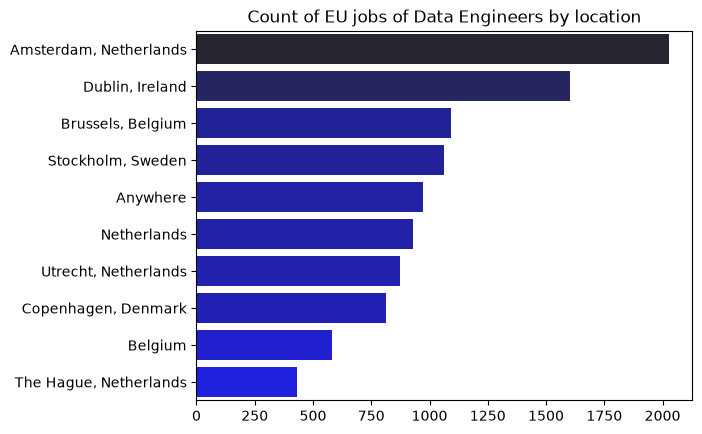
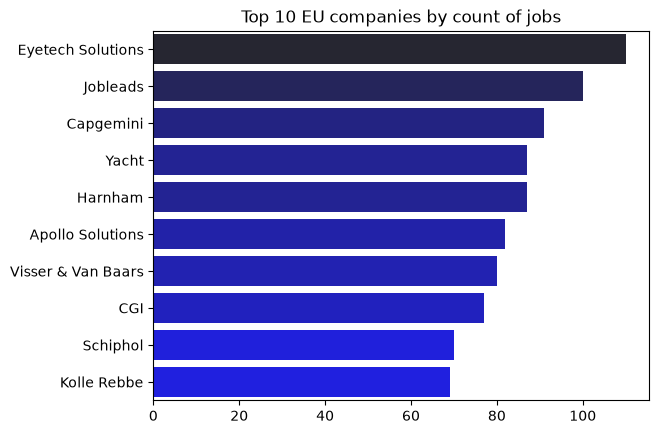

# European Data Careers: Regional Market & Skill Demand Analysis

An empirical analysis of European tech job postings focusing primarily on **Data Engineers** and **Data Scientists** across key Northern and Western European economies (Benelux and the Nordics).
This project uses real posting data to help me analyze the market and understand the professional landscape I aim to enter.

## Project Overview

By segmenting by target geographies, standardizing skill sets, and calculating unskewed appearance rates, this study evaluates:

- **Core Skill Foundations:** Which technical capabilities serve as baseline table-stakes across data disciplines.
- **Skill Payoff & Optimization:** Which tools deliver the highest salary premiums relative to their market demand.
- **Seniority Differentiation:** What specific toolsets separate mid-level from senior engineering profiles.
- **Temporal Stability:** How skill demand evolves across calendar months.
- **Geographic Density:** Where the highest concentration of engineering opportunities reside.
- **Hiring Channel Dynamics:** Which employers and staffing agencies drive public postings.

## Key Market Insights

### 1. Skill Payoff & The Optimal Skills Matrix

- **Baseline Necessities (High Likelihood, Standard Pay):** Python (\~64%) and SQL (\~55%) are the most demanded skills by a wide margin. However, their median salaries cluster tightly around the market baseline ($132,500 to $133,000). They function as mandatory tickets to entry rather than direct drivers of outsized compensation premiums.
- **Premium Specializations (Lower Volume, High Payoff):** Apache Spark (\~29%), Apache Airflow (\~15%), and Tableau (\~13%) command the highest market salary premiums, with their medians peaking at **$147,500**. This demonstrates that distributed computing, data pipeline orchestration, and enterprise business intelligence are highly lucrative specializations that signal advanced architectural maturity.
- **Cloud & Enterprise Workhorses:** AWS (\~32% demand, \~$134,000) and Azure (\~21% demand, \~$131,500) maintain strong market penetration, but their median compensation tracks closer to the foundational baseline, alongside traditional enterprise languages like Java.

### 2. The Python & SQL Dual Monopoly

- **Universal Baseline:** Python and SQL are absolute requirements across all roles. Over **55%** of all Data Engineer postings require both SQL (55.5%) and Python (55.3%).
- **Discipline Divergence:**
  - **Data Science:** Python demand spikes to **60.2%**, while SQL recedes to a secondary role at **39.3%**. Specialized statistical packages like R (29.9%) and SAS (12.0%) maintain presence but trail Python significantly.
  - **Data Engineering:** SQL and Python maintain near-identical parity (\~55% to 58%), proving that backend transformation logic and database querying are co-equal daily demands.

### 3. The Cloud Divide: Microsoft Azure vs. AWS

- **Azure lead:** In these target European market (Benelux/Nordics) samples, postings mentioning Azure had a higher observed median advertised salary than Amazon Web Services (AWS).
  - Data Engineers: Azure appears in **43.2%** of postings vs. AWS at **26.1%** (a 1.65x preference).
  - Senior Data Engineers: Azure leads at **45.4%** vs. AWS at **36.7%**.
- **Enterprise Infrastructure:** Azure's substantial lead reflects widespread enterprise adoption across European corporate IT infrastructures, making Azure data services (ADLS, Synapse, Databricks, Data Factory) high-ROI investments.

### 4. Seniority Lift: Distributed Systems and Multi-Cloud

- **Spark as a Seniority Differentiator:** Big data processing via Apache Spark rises from **20.5%** in general Data Engineering roles to **28.5%** in Senior Data Engineering postings.
- **Multi-Cloud Fluency:** Senior roles demand broader cloud literacy—AWS demand increases by over **10 percentage points** (from 26.1% to 36.7%) at the senior tier, highlighting that senior engineers are expected to design cross-platform architectures.

### 5. Temporal Trends: Seasonal Hiring & Stack Stability

- **Invariant Skill Hierarchy:** The relative ranking of technologies (**Python > SQL > Azure > AWS > R**) experiences zero crossover across all 12 calendar months.
- **Mid-Year Surge:** Market demand reaches its annual maximum in **June**, with Python posting likelihood peaking at **61.5%** and SQL at **53.0%**.
- **Late-Year Softening:** Q4 (September–December) exhibits a 4–7% contraction in explicit skill tags across postings, while Python-to-R ratios widen as R demand declines to an annual low of \~13% by December.

### 6. Geographic Clustering: The Benelux-Nordic Tech Corridor

- **The Dutch Hub:** The Netherlands represents the single largest cluster of openings. **Amsterdam** leads all European cities with **2,000+** postings, supplemented by regional sub-hubs in Utrecht (\~870) and The Hague (\~430).
- **Secondary Tech Capitals:** **Dublin, Ireland** (\~1,600 postings), **Brussels, Belgium** (\~1,090 postings), and **Stockholm, Sweden** (\~1,055 postings) follow as major centers.
- **Remote Availability:** Remote roles tagged as `Anywhere` account for nearly **1,000 postings**, establishing cross-border remote work as a distinct, viable hiring category.

### 7. Hiring Channels: The Agency-Dominated Labor Market

- **Intermediary Dominance:** The top public posting entities are not corporate enterprise headquarters, but specialized IT and data recruitment agencies. **Eyetech Solutions**, **Jobleads**, **Yacht**, **Harnham**, **Apollo Solutions**, and **Visser & Van Baars** make up the majority of the top 10.
- **Direct Hiring:** Large IT consulting firms (**Capgemini**, **CGI**) and infrastructure operators (**Schiphol Group**) represent the few direct-hiring organizations operating at scale in public aggregators.

## Visual Explorations

### 1. The Optimal Skills Matrix

Compensation payoff versus posting likelihood for the top technical skills:

### 2. Skill Likelihood Across Data Roles

Likelihood of specific technologies appearing in target European job postings:

### 3. Monthly Skill Demand Trends (Seasonal Analysis)

Monthly trajectory of top technical requirements for Data Engineers and Data Scientists throughout the year:

### 4. Geographic Hubs & Active Hiring Organizations

Geographic concentration of openings and the primary organizations listing public positions:

|            Top Hiring Locations            |             Top Hiring Companies              |
| :----------------------------------------: | :-------------------------------------------: |
|  |  |

_Reminder: These statistics and locations are in relation to countries of interest set in the analysis for primarily Data Engineer and Data Scientist job postings in a particular time period, they do not
represent all the listings in Europe, in the dataset or across all jobs for that matter._

## Methodology

1. **Target Market Filtering:**
   Filtered for target European economies: Denmark, Netherlands, Sweden, Norway, Belgium, Luxembourg, and Ireland.
2. **List Parsing:**
   Applied `ast.literal_eval` to safely parse serialized string representations of skill lists into native Python list objects.
3. **Denominator Standardization:**
   Calculated total postings per role (`jobs_total`) **prior** to unnesting skills:
   $$
   \text{Skill Percentage} = \frac{\text{Postings requiring Skill}}{\text{Total Postings for Role}}
   $$
4. **Chronological Alignment:**
   Parsed date attributes using vectorized datetime extraction (`pd.to_datetime(..., format='%B').dt.month`) to avoid alphabetical month sorting artifacts across line and trend plots.

## Tech Stack

- **Language:** Python 3.10+
- **Data Manipulation:** `pandas`, `numpy`
- **Visualization:** `matplotlib`, `seaborn`, `adjustText`
- **Source Dataset:** (`data_jobs.csv` / Hugging Face `datasets`)
